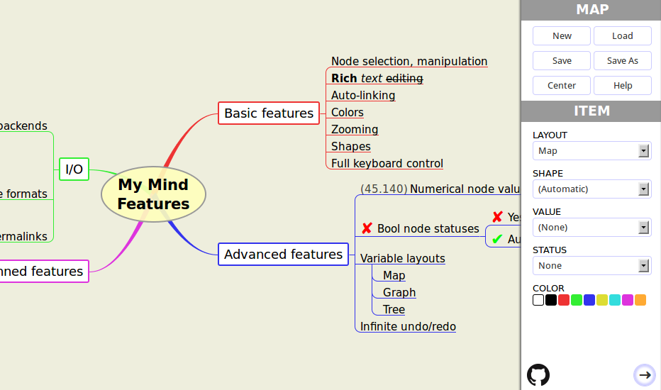

My Mind
=======

My Mind is a web application for creating and managing Mind maps. It is free to use and you can fork its source code. It is distributed under the terms of the MIT license.

New to Mind maps? They are useful, aesthetic and cool! Read more about these special diagrams in [the Wikipedia article](http://en.wikipedia.org/wiki/Mind_map).

* [Official web page](http://my-mind.github.io/)
* [Sample mind map](http://my-mind.github.io/?map=examples/features.mymind) showcasing many features
* [News / Changelog](https://github.com/ondras/my-mind/wiki/News)
* [Documentation](https://github.com/ondras/my-mind/wiki)
* 

My Mind is being actively developed. Do you want to participate?

* Found a bug? [Open an issue.](https://github.com/ondras/my-mind/issues)
* Not sure how to do stuff? [Check the docs.](https://github.com/ondras/my-mind/wiki)
* Have a feature request? [Open an issue.](https://github.com/ondras/my-mind/issues)
* Have an improvement? [Submit a pull request.](https://github.com/ondras/my-mind/pulls)
